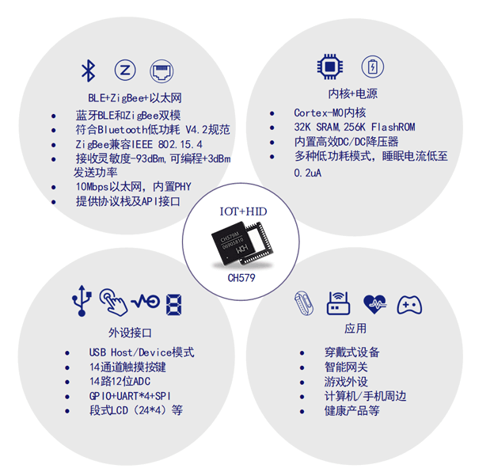
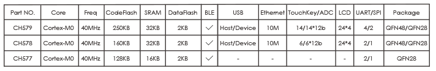
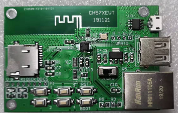

# [CH579](https://github.com/SoCXin/CH579)

* [WCH](http://www.wch.cn/)：[Cortex-M0](https://github.com/SoCXin/Cortex)
* [L2R2](https://github.com/SoCXin/Level)：40 MHz

## [简介](https://github.com/SoCXin/CH579/wiki)

[CH579](https://github.com/SoCXin/CH579) 片上集成低功耗蓝牙BLE(4.2)通讯模块、以太网控制器及收发器、全速USB主机和设备控制器及收发器、段式LCD驱动模块、ADC、触摸按键检测模块、RTC等外设。

32K SRAM，250KB，2KB DataFlash, 4KB BootLoader支持ICP、ISP、IAP、OTA

支持USB2.0全速和低速主机或设备，支持控制/批量/中断同步传输，支持USB type-C主从/电流检测,提供14通道12位ADC模数转换器，支持14通道触摸按键,提供4组26位定时器，支持捕捉/采样，支持12路PWM输出。

#### 关键特性

* 32K SRAM，250KB，2KB DataFlash, 4KB BootLoader
* BLE 4.2，Zigbee兼容IEEE 802.15.4规范，单端RF接口无需外部电感
* 支持3.3V和2.5V电源，范围2.1V～3.6V, 内置DC/DC转换
* 提供10M以太网接口，内置PHY
* SPI x 2 + UART x 4 (16C550/6Mbps)
* 内置实时时钟RTC
* 内置温度传感器
* 内置AES-128加解密单元
* 支持8位被动并口

### [资源收录](https://github.com/SoCXin)

* [参考资源](src/)
* [参考文档](docs/)
* [参考工程](project/)

### [选型建议](https://github.com/SoCXin)

[CH579](https://github.com/SoCXin/CH579) 是一款非常有特色的SoC，在紧凑的封装内集成了以太网所有功能，同时还具有无线通信。

* QFN48(5X5)
* QFN28(4X4)

#### 相关开发板

### [探索芯世界 www.SoC.xin](http://www.SoC.Xin)
