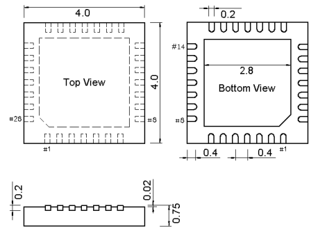

# [CH579](https://github.com/sochub/CH579)
 
#### 厂商：[WCH](https://github.com/sochub/WCH) 
#### 父级：[CH57无线系列](https://github.com/sochub/CH57) 
#### 架构：[Cortex M0](https://github.com/sochub/CM0) 

### [描述](https://github.com/sochub/CH579/wiki) 

CH579 Cortex M0内核微控制器，片上集成低功耗蓝牙BLE和Zigbee通讯模块、以太网控制器及收发器、全速USB主机和设备控制器及收发器、段式LCD驱动模块、ADC、触摸按键检测模块、RTC等丰富的外设资源。

 

关键参数：

* Cortex-M0内核，最高40MHz系统主频
* 32K SRAM，250KB CodeFlash，2KB DataFlash, 4KB BootLoader，支持ICP、ISP和IAP，支持OTA无线升级
* 蓝牙BLE和Zigbee双模，BLE兼容4.2规范，Zigbee兼容IEEE 802.15.4规范
* 集成2.4GHz RF收发器和基带及链路控制，单端RF接口，无需外部电感
* 支持3.3V和2.5V电源，范围2.1V～3.6V, 内置DC/DC转换，0dBm发送功率时电流6mA
* 多种低功耗模式：Idle，Halt，Sleep，Shutdown，内置电池电压低压监控，最低电流0.2uA
* 提供10M以太网接口，内置PHY
* 支持USB2.0全速和低速主机或设备，支持控制/批量/中断同步传输，支持USB type-C主从/电流检测
* 提供14通道12位ADC模数转换器，支持14通道触摸按键
* 提供4组26位定时器，支持捕捉/采样，支持12路PWM输出
* 提供4组独立UART，兼容16C550，最高通讯波特率可达5Mbps
* 提供2组独立SPI，内置FIFO ，SPI0支持Master和Slave模式，支持DMA
* 提供40个GPIO，32个中断输入
* 内置AES-128加解密单元，芯片唯一ID

### [资源收录](https://github.com/sochub/CH579)

* [文档](docs/) 
    * [芯片手册](docs/) 
* [资源](src/) 
    * [软件资源](src/software) 
    * [硬件资源](src/hardware) 

#### [硬件开发](https://github.com/sochub/CH579)

CH579目前提供两种QFN封装规格

* CH579M 封装：QFN48 （5mm x 5mm）

* CH579F 封装：QFN28 （4mm x 4mm）

* [kicad库资源](src/kicad/)

### [选型建议](https://github.com/sochub/CH579)

关注[WCH](https://github.com/sochub/WCH) 芯片产品应该都是对USB通信接口有需求，在已知的CH单片机系列产品中，都包括了USB相应的功能，CH579是无线通信系列中的最高规格产品，包括双模无线通信和片上集成的以太网功能，而且整个CH57X系列都是QFN封装，芯片接口较紧凑。

* 单纯的BLE通信替换可采用[NRF52](https://github.com/sochub/NRF52) 和 [CC2640](https://github.com/sochub/CC2640)及相接近的产品。

* 同系列产品[CH578](https://github.com/sochub/CH578) 和 [CH576](https://github.com/sochub/CH576)降低了无线协议支持、RAM和flash大小。

###  [SoC资源平台](http://www.qitas.cn)
